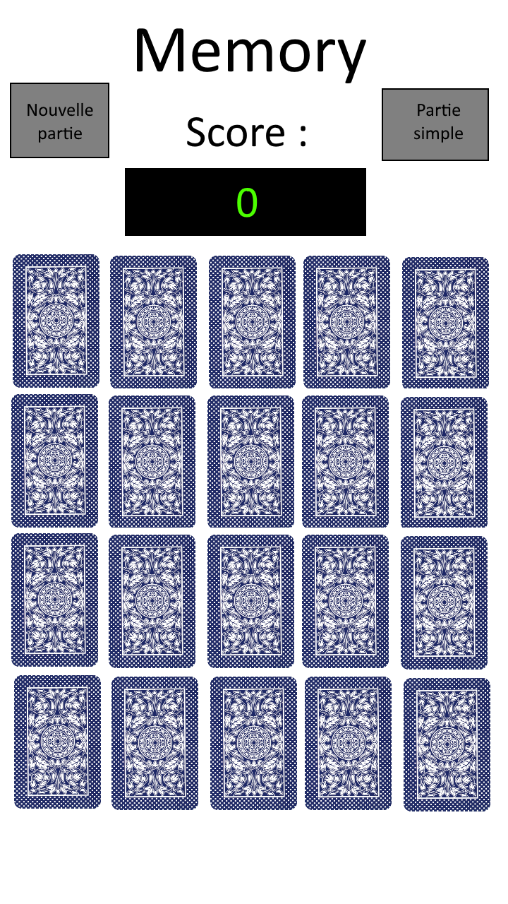
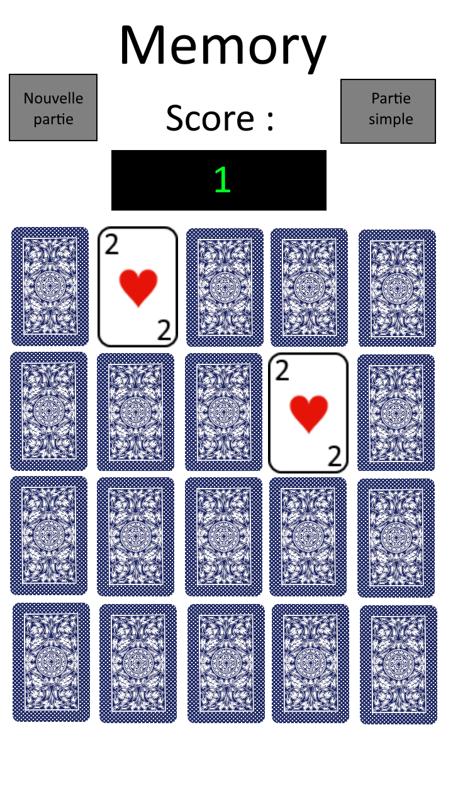
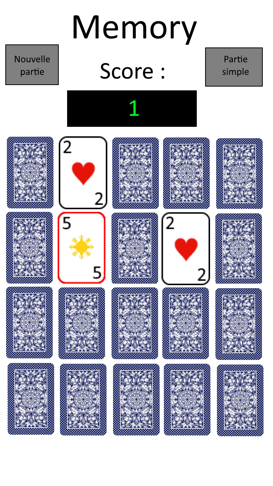

= Projet PWCR

GALLO GONZALEZ 

Alexandre

== Dessin

== Structure de donnés

* Projet réalisé sous jquery et Javascript.

* 20 images cliquables cliquables.

* 2 variables globales contenant les images où l'on a cliqué.

* 1 variable globale booléenne qui vaut true si la partie est démaré

* 1 variable globale booléenne qui vaut true si l'on a le droit de cliquer

== Algo fin partie

[source,javascript]
----
...(algo lorsque l'utilisateur à cliqué sur la 2eme carte à découvrir)...
// Une carte reste découverte si l'on a trouvé sa paire
finPartie = true
POUR toute les entrés du  contenant les cartes FAIRE
    SI carte.estDecouverte == false  Alors
        finPartie = false
    FSI
FPOUR

SI finPartie == true
    Affiche "GAGNE !!!!!"
FSI
----